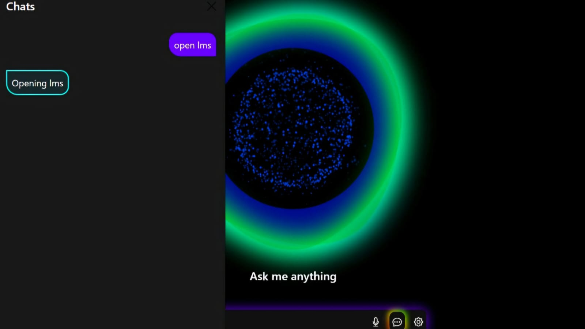
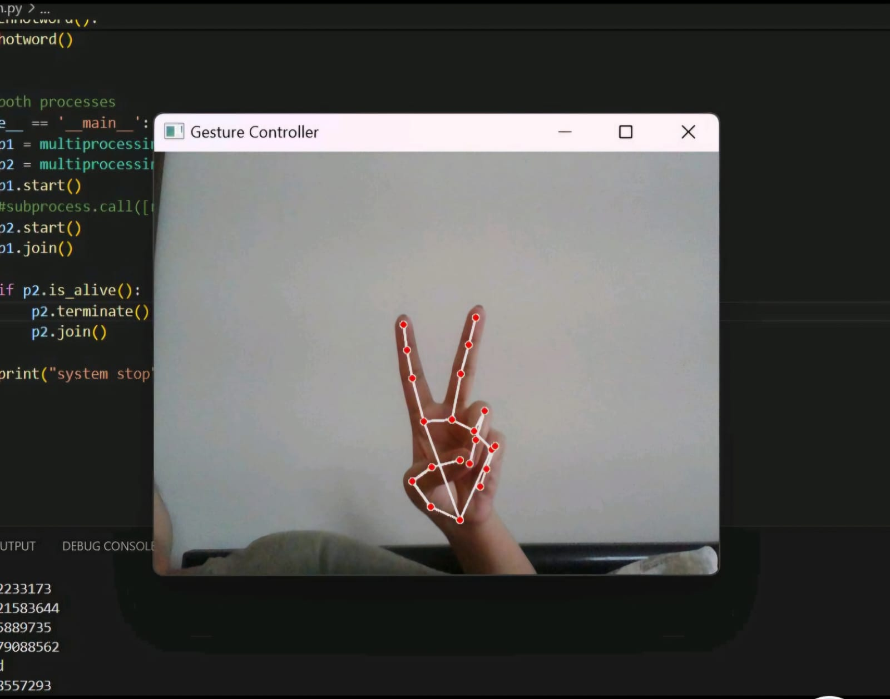

# 🌟 Signify: Your Smart Chatbot Companion 🤖✨

Welcome to **Signify**, your AI-powered smart assistant that combines intelligence, convenience, and a sprinkle of fun! 🚀💬 With Signify, you can chat naturally, search the web 🌐, and even launch apps 📱 — all through voice and gesture controls. Ready to make life easier and cooler? Let’s dive in! 🌊

---

## 🚀 Features That Will Blow Your Mind 🤯
- 🎙️ **Voice Commands**: Talk to your chatbot like a pro!
- 👋 **Gesture Control**: Use your hands to interact — it’s magic! 🪄
- 🔍 **Web Search**: Ask questions, get answers, surf the net in style.
- 📂 **App Launcher**: Open apps effortlessly. Just say the word!
- 🧠 **AI-Powered**: Powered by HuggingChat for smart, natural conversations.

---

## 📸 Sneak Peek
Here’s a glimpse of Signify in action! 🌟

### 1️⃣ Home Screen 🏠  


### 2️⃣ Chat Interface 💬  


### 3️⃣ Gesture Control 🚀  


---

## 🛠️ Tech Stack
Built with love ❤️ and cutting-edge tech 🧑‍💻:
- **Languages**: Python 🐍, JavaScript 🌐
- **Libraries/Frameworks**: Flask, TensorFlow, OpenAI API
- **Front-End**: HTML5, CSS3 🎨
- **Back-End**: Flask 🧰
- **Integrations**: HuggingChat 🤝

---

## 🚀 Get Started
Follow these simple steps to bring Signify to life! 🌟

1. **Clone the Repository** 🧑‍💻:
   ```bash
   git clone https://github.com/kanikac199/Signify-chatbot-.git
